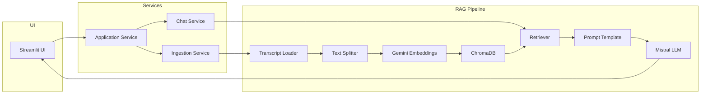

# 🎥 YouTube Transcript RAG Chatbot

A production-ready **Retrieval-Augmented Generation (RAG)** chatbot that enables users to interact with YouTube videos using natural language. The application automatically extracts video transcripts, generates semantic embeddings using **Google Gemini**, stores them in **ChromaDB**, and answers user questions using the **Mistral LLM** through an interactive **Streamlit** interface.

---

## 🚀 Features

- 🎥 Chat with YouTube videos using their transcripts
- 🤖 Retrieval-Augmented Generation (RAG)
- ⚡ Automatic transcript extraction and indexing
- 📚 Multi-video support
- 🧠 Google Gemini Embeddings for semantic search
- 🗄️ ChromaDB vector database
- 💬 Mistral LLM for answer generation
- 🎨 Streamlit web interface
- 🐳 Dockerized application
- 🔄 Automatic vector database creation for new videos

---

## 🏗️ System Architecture



---

## 📂 RAG Workflow

```text
User enters YouTube URL
        │
        ▼
Extract Video ID
        │
        ▼
Check if Vector Database Exists
        │
   ┌────┴────┐
   │         │
Exists     Doesn't Exist
   │         │
Load DB   Download Transcript
             │
             ▼
        Split into Chunks
             │
             ▼
Generate Gemini Embeddings
             │
             ▼
Store in ChromaDB
             │
             ▼
Ready for Chat
             │
             ▼
User asks Question
             │
             ▼
Retrieve Relevant Chunks
             │
             ▼
Generate Answer using Mistral
```

---

## 📁 Project Structure

```text
youtube-rag-chatbot/
│
├── src/
│   ├── chains/
│   ├── database/
│   ├── loaders/
│   ├── models/
│   ├── processing/
│   ├── prompts/
│   ├── retrieval/
│   ├── services/
│   ├── utils/
│   └── config.py
│
├── streamlit_app.py
├── Dockerfile
├── requirements.txt
├── .env.example
└── README.md
```

---

## 🛠️ Tech Stack

| Category | Technology |
|----------|------------|
| Programming Language | Python |
| LLM Framework | LangChain |
| Large Language Model | Mistral AI |
| Embedding Model | Google Gemini |
| Vector Database | ChromaDB |
| Frontend | Streamlit |
| Containerization | Docker |
| Transcript Loader | YouTube Transcript API |

---

## ⚙️ Installation

### 1. Clone the repository

```bash
git clone https://github.com/<your-username>/youtube-rag-chatbot.git
cd youtube-rag-chatbot
```

### 2. Create a virtual environment

```bash
python -m venv .venv
```

### 3. Activate the virtual environment

**Windows**

```bash
.venv\Scripts\activate
```

**Linux / macOS**

```bash
source .venv/bin/activate
```

### 4. Install dependencies

```bash
pip install -r requirements.txt
```

### 5. Configure environment variables

Copy:

```text
.env.example
```

to

```text
.env
```

and provide your API keys.

### 6. Run the application

```bash
streamlit run streamlit_app.py
```

---

## 🐳 Docker

### Build Docker image

```bash
docker build -t youtube-rag .
```

### Run Docker container

```bash
docker run -p 8501:8501 --env-file .env youtube-rag
```

Then open:

```
http://localhost:8501
```

---

## 📸 Application Preview

> Screenshots will be added after deployment.

---

## 🚀 Future Improvements

- Streaming LLM responses
- Source citations for retrieved chunks
- Conversation memory
- Hybrid search
- FastAPI backend
- AWS deployment
- CI/CD using GitHub Actions

---

## 🤝 Contributing

Contributions, suggestions, and improvements are welcome.

Feel free to fork the repository, create a feature branch, and submit a pull request.

---

## 📜 License

This project is licensed under the MIT License.

---

## 👨‍💻 Author

**Saurav Kumar**

M.Tech (Computer Science & Engineering), IIT Goa

GitHub: https://github.com/sanebugger